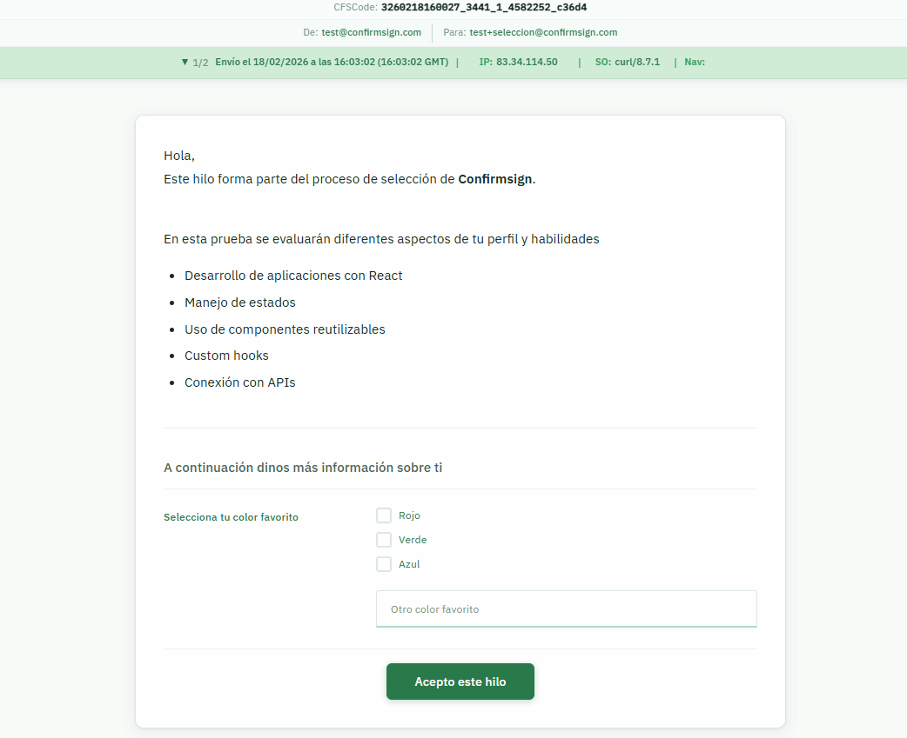

# ConfirmSign Thread Viewer

Aplicación React desarrollada como prueba técnica para ConfirmSign. Permite visualizar y aceptar hilos de comunicación legal a través de la API de ConfirmSign.

<br />



## Tecnologías

- **React** 18.2.0
- **Webpack 5** + Babel
- **SCSS** con metodología BEM
- **Axios** para las peticiones HTTP
- **React Router v6** para la navegación

## Requisitos

- Node >= 20
- npm >= 10

## Instalación

```bash
npm install
```

## Ejecución en desarrollo

```bash
npm start
```

La aplicación estará disponible en `http://localhost:8080`.

## Build de producción

```bash
npm run build
npm run serve:build
```

## Uso

La aplicación se accede mediante la URL:

```
http://localhost:8080/{cfskey}/{cfstoken}
```

Donde `cfskey` y `cfstoken` son los parámetros del hilo proporcionados por ConfirmSign. Acceder a `http://localhost:8080` sin parámetros mostrará una página 404.

## Estructura del proyecto

```
src/
├── components/
│   ├── TopBar/          # Barra superior fija (CFSCode, emisor, destinatario, histórico)
│   ├── ThreadContent/   # Contenido HTML del hilo, formularios y botón de aceptar
│   ├── Forms/           # Componentes de formulario (CHECK, TEXT)
│   ├── Loader/          # Spinner de carga
│   └── ErrorDisplay/    # Pantallas de error y 404
├── hooks/
│   ├── useThread.js         # Custom hook: GET y POST del hilo con Axios
│   └── useHistoryToggle.js  # Custom hook: expand/collapse del histórico
├── pages/
│   └── ThreadPage.jsx   # Página principal con router params
├── styles/
│   ├── _variables.scss  # Variables de diseño
│   ├── _mixins.scss     # Mixins responsivos
│   ├── _global.scss     # Reset y estilos base
│   └── main.scss        # Entry point SCSS
├── App.jsx              # Configuración del router
└── index.js             # Entry point de React
```

## Funcionalidades implementadas

- Barra superior fija con CFSCode, emisor, destinatario e histórico de estados desplegable
- Visualización del contenido HTML del hilo correctamente formateado
- Formularios dinámicos (tipo CHECK y TEXT) con validación de longitud mínima y máxima
- Botón de aceptar con texto configurable desde la API (`agreement.accept_button_text`)
- Actualización de pantalla tras aceptar: banner de estado, formularios deshabilitados y botón sustituido
- Diseño responsive para móvil y escritorio
- Página 404 para rutas no válidas
- Control de errores en GET y POST con mensaje visible al usuario

## Nota sobre el endpoint POST /agreement

Durante el desarrollo se detectó que el endpoint `POST /threads/token/{cfskey}/{cfstoken}/agreement/true` devuelve un error 500 con todos los tokens disponibles, independientemente del body enviado (objeto completo del GET, objeto con formulario respondido, o body vacío). Se ha contactado con la empresa para obtener aclaración sobre el flujo esperado o posibles requisitos adicionales del body.

La lógica de aceptación está completamente implementada en el hook `useThread.js` y la UI refleja correctamente el estado post-aceptación.